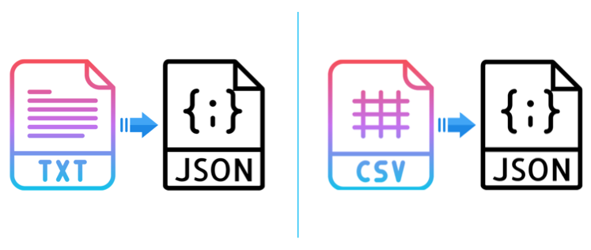

<p align="center">
  
</p>

<div align="center">

Reads a text file, CSV file or data variable having a table and returns an array of obects. In which each object consists of all headers as keys and there data as values.<br>
Can also filter data on given number of records and returns only required data in array.

</div>

## Installation

```
npm i --save data-to-json
```

## Usage

`data-to-json` support CommonJS.

### In module system

Use `filePath` key to provide `TEXT or CSV data from a file`.
```javascript
const dataToJson = require("data-to-json");
```
<br>

Use `.txt` to use TXT data.
```javascript
const dataInJSON = dataToJson.txt({ filePath: "./filePath.txt" }).toJson();
```

OR

Use `.csv` to use CSV data.
```javascript
const dataInJSON = dataToJson.csv({ filePath: "./filePath.csv" }).toJson();
```
<br>

Use `data` key to provide `TEXT data from variable or directly`.
```javascript
const dataInJSON = dataToJson.txt({ data: someTEXTData }).toJson();
```

OR

```javascript
const dataInJSON = dataToJson.csv({ data: someCSVData }).toJson();
```
<br>

#### Sample input (txt data) :
```
FIRST_NAME     LAST_NAME        NUMBER               EMAIL                        ADDRESS
Debra          Burks            880012XXXX           debra.burks@yahoo.com        9273 Thome Ave., `Orchard Park`, NY - 14127
Kasha          Todd             null                 kasha.todd@yahoo.com         910, Vine Street!!!, (Campbell), CA - 95008
Tameka         Fisher           880111XXXX           null                         7693 ~ Honey Creek St., Redondo Beach, "CA"      90278
```

#### Sample input (csv data) :
```
FIRST_NAME,LAST_NAME,NUMBER,EMAIL,ADDRESS
Debra,Burks,880012XXXX,debra.burks@yahoo.com,"9273 Thome Ave., `Orchard Park`, NY - 14127"
Kasha,Todd,null,kasha.todd@yahoo.com,"910, Vine Street!!!, (Campbell), CA - 95008"
Tameka,Fisher,8800111XXX,null,"7693 ~ Honey Creek St., Redondo Beach, "CA"      90278"
```

#### Sample output (json data) :
```
[
  {
    FIRST_NAME: 'Debra',
    LAST_NAME: 'Burks',
    NUMBER: '880012XXXX',
    EMAIL: 'debra.burks@yahoo.com',
    ADDRESS: '9273 Thome Ave., `Orchard Park`, NY - 14127'
  },
  {
    FIRST_NAME: 'Kasha',
    LAST_NAME: 'Todd',
    NUMBER: null,
    EMAIL: 'kasha.todd@yahoo.com',
    ADDRESS: '910, Vine Street!!!, (Campbell), CA - 95008'
  },
  {
    FIRST_NAME: 'Tameka',
    LAST_NAME: 'Fisher',
    NUMBER: '880111XXXX',
    EMAIL: null,
    ADDRESS: '7693 ~ Honey Creek St., Redondo Beach, "CA"      90278'
  }
]
```
<br>

Use `.records` to get required number of rows.
```javascript
const dataInJSON = dataToJson.txt({ filePath: "./filePath.txt" }).records(1).toJson();
```

OR

```javascript
const dataInJSON = dataToJson.csv({ filePath: "./filePath.csv" }).records(1).toJson();
```
<br>

#### Sample output when `.records` is `1` (json data) :
```
[
  {
    FIRST_NAME: 'Debra',
    LAST_NAME: 'Burks',
    NUMBER: '880012XXXX',
    EMAIL: 'debra.burks@yahoo.com',
    ADDRESS: '9273 Thome Ave., `Orchard Park`, NY - 14127'
  }
]
```
<br>

# References
* To convert only text to json. Try - https://www.npmjs.com/package/txt-file-to-json
* To convert only csv to json. Try - https://www.npmjs.com/package/csv-file-to-json

